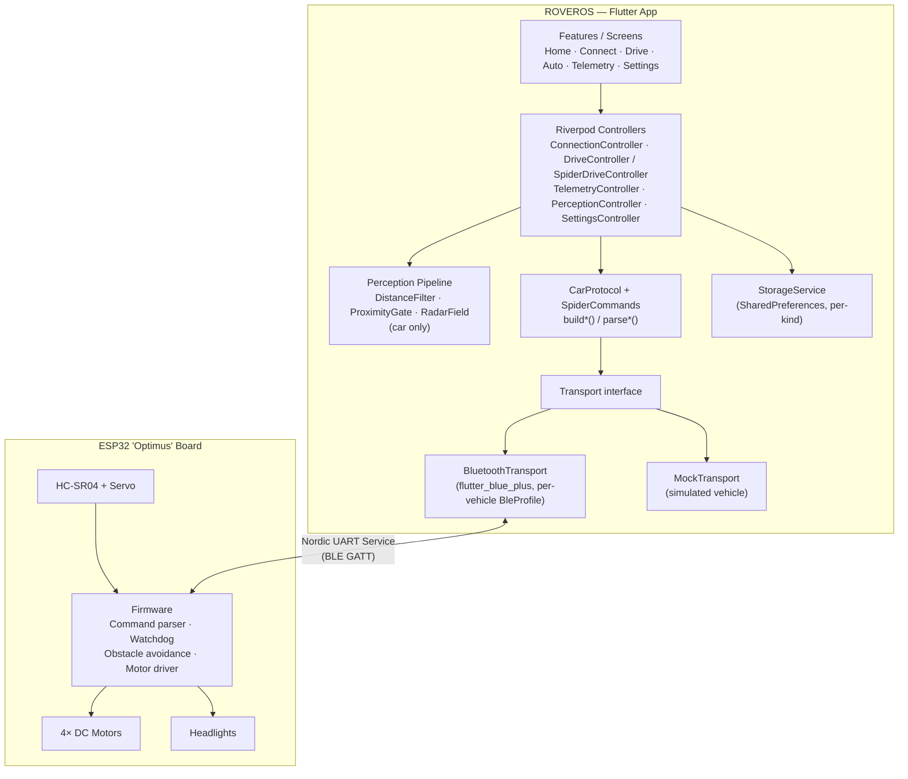
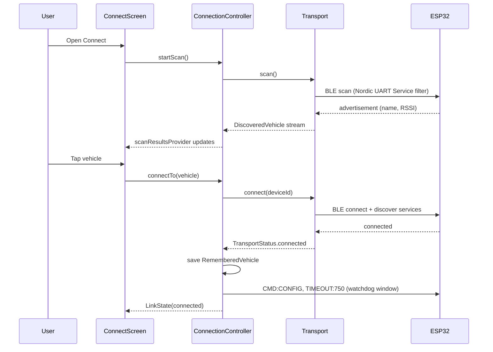
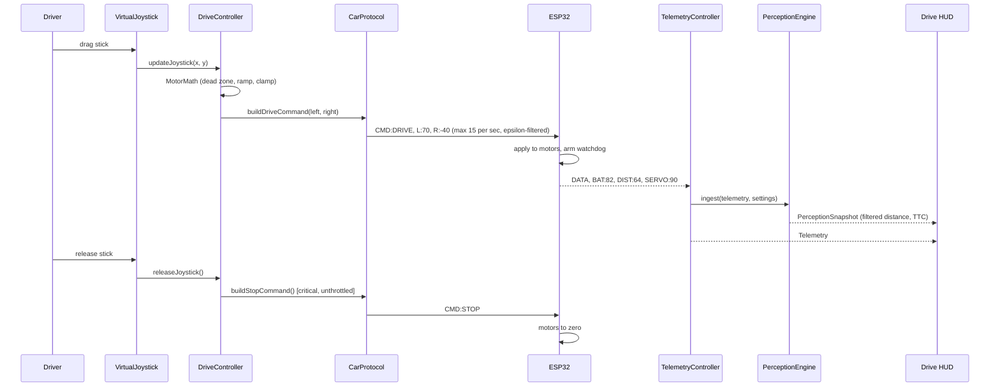
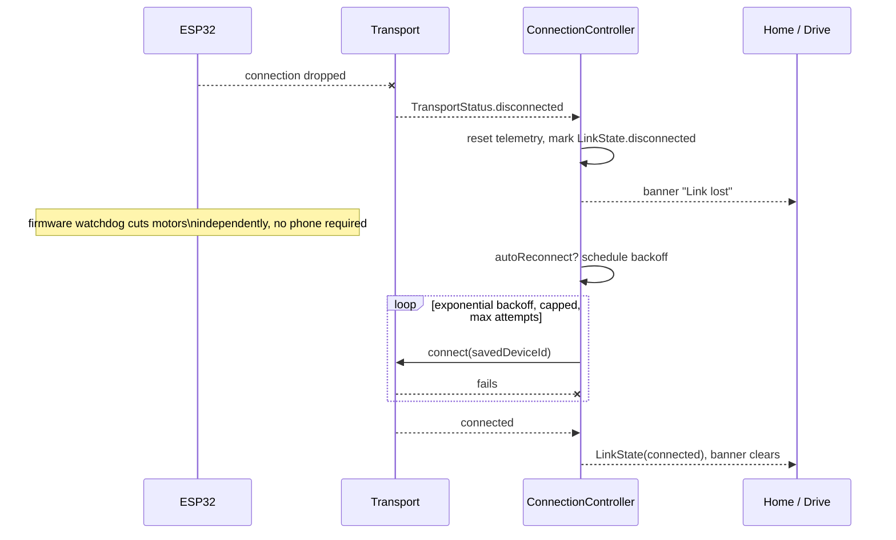

<div align="center">
  

  # ROVEROS

  **A premium, dashboard-style control console for DIY robots — an ESP32 4WD smart robot car, and an Arduino spiderbot.**

  Built to feel like an EV instrument cluster and an RC transmitter — not a bare-bones Arduino remote.

  <p>
    
    
    
    
    
  </p>
</div>

---

> **⚠ Proprietary — Closed Source.** This repository and everything in it is
> confidential and proprietary. No licence is granted to use, copy, modify,
> merge, publish, distribute, sublicense, or sell copies of this software.
> See [License](#license).

## Table of contents

- [What this is](#what-this-is)
- [Tech stack](#tech-stack)
- [Hardware targets](#hardware-targets)
- [Screens](#screens)
- [Architecture](#architecture)
- [Data flow](#data-flow)
- [Sequence diagrams](#sequence-diagrams)
- [Safety model](#safety-model)
- [How it works, step by step](#how-it-works-step-by-step)
- [Getting started](#getting-started)
- [Testing](#testing)
- [Known limitations](#known-limitations)
- [License](#license)

## What this is

ROVEROS pairs with a DIY robot over BLE and drives it from a dark,
high-contrast dashboard. It currently speaks to two vehicles, switchable from
**Settings → Vehicle → Vehicle type**, each with its own drive HUD and BLE
profile but sharing one app, one wire protocol grammar, and one transport
layer:

- **The ESP32 "Optimus" 4WD car** — an analog virtual joystick driving a
  differential-drive chassis, live telemetry (battery, distance, servo angle,
  motor output), and a phone-side perception layer that turns the raw HC-SR04
  ultrasonic sensor into a filtered, confidence-scored estimate — closing
  speed, time-to-contact, gap-finding — without the vehicle ever ceding a
  single safety decision to the app.
- **The Arduino Nano "Spiderbot"** — a direction-pad HUD driving a 4-leg trot
  gait over BLE via an add-on BLE-serial module (the Nano has no radio of its
  own). See [`firmware/roveros_spiderbot/README.md`](firmware/roveros_spiderbot/README.md)
  for wiring and known gaps — this side is newer and has not been
  hardware-verified yet (see [Known limitations](#known-limitations)).

It also runs a fully autonomous **mock vehicle** for either kind with no
hardware attached, so the whole app — including its safety behaviour — can be
built, demoed, and tested without a soldering iron.

## Tech stack

| Layer | Technology | Purpose |
|---|---|---|
| Language | [Dart 3.12+](https://dart.dev) | Sound null safety, pattern matching, sealed classes for the frame/error models |
| Framework | [Flutter 3.44](https://flutter.dev) | Single codebase, Android + iOS |
| State management | [flutter_riverpod](https://riverpod.dev) `^3.4.2` | `Notifier`s per concern (connection, drive, telemetry, settings, perception) |
| Routing | [go_router](https://pub.dev/packages/go_router) `^17.4.0` | Declarative routes, `StatefulShellRoute` for the bottom-tab shell |
| Transport | [flutter_blue_plus](https://pub.dev/packages/flutter_blue_plus) `^2.3.11` | BLE central role — scan, connect, notify/write against a per-vehicle `BleProfile` (Nordic UART Service for the car, HM-10/AT-09-style for the spider) |
| Permissions | [permission_handler](https://pub.dev/packages/permission_handler) `^13.0.0` | Runtime Bluetooth/location permission flow |
| Persistence | [shared_preferences](https://pub.dev/packages/shared_preferences) `^2.5.5` | Settings, one remembered vehicle per kind, activity log |
| Sharing | [share_plus](https://pub.dev/packages/share_plus) `^12.0.1` | Session-log export from the Telemetry screen |
| Firmware targets | ESP32 ("Optimus" board) · Arduino Nano ("Spiderbot") | BLE peripheral, motor/servo driver, sensor I/O, the only thing that decides to stop |
| Testing | `flutter_test` | 100 tests — protocol, motor math, perception filters, layout metrics, a11y (car path; see [Known limitations](#known-limitations)) |

## Hardware targets

### Car — ESP32 "Optimus" 4WD

| Component | Role |
|---|---|
| ESP32 "Optimus" controller board | Central MCU, BLE peripheral |
| 4× TT geared DC motor + driver | Differential drive |
| 2× 18650 Li-ion | Power |
| HC-SR04 | Front obstacle distance |
| SG90 9g servo | Sweeps the HC-SR04 for the radar view |
| White LED headlights | Solid / flash / hazard, ESP32-timed |

Firmware: [`firmware/roveros_op0148/`](firmware/roveros_op0148/).

### Spider — Arduino Nano "Spiderbot"

| Component | Role |
|---|---|
| Arduino Nano | Central MCU — no radio of its own |
| HM-10/AT-09-class BLE-serial module | Bridges the Nano's UART to BLE; see [Known limitations](#known-limitations) |
| 8× MG90 servo (hip + knee × 4 legs) | Trot gait |
| 2× 18650 Li-ion | Power |

Firmware: [`firmware/roveros_spiderbot/`](firmware/roveros_spiderbot/) — this
kit ships generic with no fixed pinout, so wiring, exact BLE module UUIDs and
gait tuning are starting points to verify on the bench, not confirmed values;
see that folder's README for the specifics.

**The phone never makes a safety decision, for either vehicle.** Motor/gait
stop logic and the communication watchdog live on the vehicle's own MCU (plus
autonomous obstacle-avoidance decisions, for the car). The app only sends
high-level commands and displays what the vehicle reports back — see [Safety
model](#safety-model) below.

## Screens

| Screen | Orientation | Purpose |
|---|---|---|
| Splash | Portrait | Boot sequence: load settings, check saved vehicle, animate in |
| Home | Portrait | Vehicle status, battery, readiness, recent activity, START DRIVING |
| Connect | Portrait | BLE scan/connect/reconnect (against the active vehicle's `BleProfile`), connection-quality detail |
| **Drive** (car) | **Landscape** | Joystick, speed, emergency stop, lights, distance, servo/radar preview |
| **Drive** (spider) | **Landscape** | Direction pad, gait speed, emergency stop, animated walking indicator |
| Auto | Portrait | MANUAL / OBSTACLE AVOIDANCE / AUTO SCAN, live radar, vehicle decisions — car only, see [Known limitations](#known-limitations) |
| Telemetry | Portrait | Full dashboard: every reported value, link health, trend sparklines, last ACK, errors |
| Settings | Portrait | Vehicle type, controls, motors, sensors, lights, connection, app preferences — the spider hides the car-only calibration sections |

## Architecture

```
lib/
  core/          theme, constants, router, pure utils (motor math, throttle,
                 clamp, validation), perception pipeline, Riverpod bootstrap
  models/        strongly-typed domain types (Telemetry, Settings, Commands,
                 ConnectionState, Vehicle) — no protocol strings, no widgets
  services/      car_protocol.dart (the ONLY place that builds/parses wire
                 frames), storage_service.dart, transport/ (the abstraction)
  features/      one folder per screen: screen + controller (Riverpod
                 Notifier) + local widgets/
  widgets/       the shared UI kit (AppButton, AppCard, TelemetryCard, …)
```

**Transport abstraction.** `Transport` is a single interface
(`connect/disconnect/send/subscribe/scan`) implemented by both
`BluetoothTransport` (flutter_blue_plus) and `MockTransport` (a simulated
vehicle with its own watchdog, telemetry stream, and injectable faults). The
UI and drive controllers depend only on this interface, so mock and real
hardware are interchangeable behind one `transportProvider`.

**Vehicle kind.** [`VehicleKind`](lib/models/vehicle_kind.dart) (`car` /
`spider`) is the one switch the rest of the app reads: it carries each
vehicle's `BleProfile` (service/write/notify UUIDs — the car's split Nordic
UART RX/TX pair vs. the spider's single-characteristic HM-10/AT-09 shape),
its scan name hints, and its default vehicle name.
`AppSettings.vehicleKind` selects it; `BluetoothTransport`'s constructor and
`StorageService`'s per-kind-keyed remembered-vehicle storage both take it
directly, so the car and spider can be paired independently and switching
between them in Settings tears down and rebuilds the transport against the
right profile.

**Protocol.** Every wire token lives in
[`command_constants.dart`](lib/core/constants/command_constants.dart); every
frame is built or parsed by
[`car_protocol.dart`](lib/services/car_protocol.dart)
(`buildDriveCommand`, `buildStopCommand`, `parseTelemetry`, `parseAck`,
`parseError`, `validateCommand`, …) — reused unchanged for both vehicles,
since inbound frame parsing has no car-specific gating. The spider adds
exactly one outbound verb, `CMD:WALK`, built by
[`spider_commands.dart`](lib/services/spider_commands.dart); everything else
it needs (`STOP`/`PING`/`CONFIG`) is the same generic builder the car uses.
No widget ever touches a raw command string.

**State.** Riverpod `Notifier`s split communication state
(`ConnectionController`, holding the `LinkState`) from commanded/UI state
(`DriveController` for the car's `DriveState`; `SpiderDriveController` for the
spider's much simpler `SpiderDriveState` — a held direction and a speed, no
ramping) from vehicle-reported truth (`TelemetryController`) from phone-side
inference (`PerceptionController`, holding a `PerceptionSnapshot`, car only).
Settings persist through `StorageService` (SharedPreferences) and are
re-validated on every load.

**Perception.** `core/perception/` is an ordinary Dart pipeline (no Flutter,
no Riverpod) that turns one HC-SR04 reading per servo bearing into a filtered
estimate: a Kalman-style `DistanceFilter` per bucketed angle, a `ProximityGate`
that adds hysteresis so a boundary reading can't strobe the UI between
states, and a `RadarField` that segments the swept readings into surfaces and
gaps. It is advisory end to end — nothing downstream may build a command from
it, and the vehicle never sees its output. Car only — the spider has no
ultrasonic sensor.

### Component diagram

Traces the car's path in full detail, since it's the richer of the two. The
spider rides the same `Transport`/`Protocol`/`Storage` backbone through its
own `BleProfile` and `SpiderDriveController` — just without the perception
stage or the car-only wire verbs — see [Vehicle kind](#architecture) above.



## Data flow

Two independent loops run at all times once connected — an outbound command
loop and an inbound telemetry loop — plus a phone-side inference stage that
sits only on the inbound side. Shown for the car; the spider's loop is the
same shape with `SpiderDriveController`/`CMD:WALK` in place of
`DriveController`/`CMD:DRIVE`, and no perception stage.

```mermaid
flowchart LR
    Stick["Virtual Joystick"] -->|"x, y"| DriveCtrl["DriveController"]
    Speed["Speed / Lights / Servo controls"] --> DriveCtrl
    DriveCtrl -->|"throttled max 15 per sec\nepsilon-filtered"| Protocol1["CarProtocol.build*()"]
    Protocol1 -->|"CMD:DRIVE, L:70, R:-40"| Transport1["Transport.send()"]
    Transport1 -->|"BLE write"| ESP32["ESP32 firmware"]

    ESP32 -->|"BLE notify"| Transport2["Transport.subscribe()"]
    Transport2 -->|"DATA, BAT:82, DIST:64, ..."| Protocol2["CarProtocol.parseFrame()"]
    Protocol2 -->|"TelemetryFrame"| TelemetryCtrl["TelemetryController"]
    Protocol2 -->|"AckFrame"| AckState["lastAckProvider"]
    Protocol2 -->|"ErrorFrame"| ErrorState["vehicleErrorProvider"]

    TelemetryCtrl --> PerceptionEngine["PerceptionEngine\n(DistanceFilter → ProximityGate → RadarField)"]
    PerceptionEngine --> PerceptionSnapshot["PerceptionSnapshot\nfiltered distance · confidence\nclosing speed · time-to-contact · gaps"]

    TelemetryCtrl --> DashboardUI["Home / Telemetry / Drive HUD"]
    PerceptionSnapshot --> DashboardUI
    AckState --> DashboardUI
    ErrorState --> DashboardUI
    ErrorState -->|"fail-safe error"| AutoCtrl["AutoScreen listener\nforces DriveMode.manual"]
```



## Sequence diagrams

Drawn for the car — the deeper of the two flows. The spider's pairing
sequence is identical (same `ConnectionController`, same `RememberedVehicle`
save, just the spider's `BleProfile`); its driving loop swaps
`VirtualJoystick`/`DriveController`/`CMD:DRIVE` for
`DirectionPad`/`SpiderDriveController`/`CMD:WALK` and has no perception step;
link loss and recovery are exactly the same code path for both.

### Pairing and connecting



### Driving loop (joystick → command → telemetry)



### Link loss and recovery



## Safety model

These apply to both vehicles unless noted — each MCU (ESP32 or Nano) runs its
own independent copy of the watchdog logic; nothing here is shared code
between them, just the same design repeated on each firmware.

1. **The vehicle owns the stop.** Both firmwares run their own communication
   watchdog — if no valid drive command arrives within a configurable window
   (sent via `CMD:CONFIG;TIMEOUT:ms`, default 750ms), it cuts the motors (or
   returns the legs to neutral) itself. The app never has to succeed at
   sending a message for the vehicle to stop safely.
2. **Release-to-stop bypasses everything.** Letting go of the joystick (car)
   or a direction button (spider) sends `CMD:STOP` immediately, ungated by
   throttling or acceleration ramping.
3. **Leaving Drive, backgrounding the app, or losing the link** all trigger an
   immediate stop attempt and clear the commanded output client-side.
4. **Emergency stop latches.** It requires a deliberate second tap to release
   — a twitching thumb can't immediately re-arm the motors.
5. **Autonomous decisions happen on the vehicle — car only.** The phone only
   sends `CMD:MODE`/`CMD:SCAN` and displays `telemetry.decision`; a reported
   sensor or motor fault automatically drops the app out of autonomous mode.
   The spider has no autonomous mode yet.
6. **Drive commands are throttled and epsilon-filtered** (≤15/s, changes below
   a small threshold are skipped) so the radio is never flooded — but a
   transition to or from a full stop is never suppressed.
7. **Perception is advisory only — car only.** The phone-side filter can flag
   an obstacle as unreliable or estimate time-to-contact, but it never builds
   a command — it only tells the driver what it believes, and says plainly
   when it doesn't believe itself. The spider has no sensor to build this
   from.

## How it works, step by step

1. **Boot.** `SplashScreen` loads persisted settings, checks for a remembered
   vehicle of the active kind, and routes to onboarding (first run) or the
   shell (returning user).
2. **Pick a vehicle.** Settings → Vehicle → Vehicle type selects `car` or
   `spider`, which decides the `BleProfile` scanned/connected below and which
   Drive HUD opens. Switching it tears down and rebuilds the connection
   against the new vehicle.
3. **Pair.** `Connect` scans for BLE devices matching the active vehicle's
   profile, surfaces that kind's saved vehicle first, and connects on tap. On
   success, the watchdog timeout is pushed to the vehicle and it's remembered
   for next time (independently per kind).
4. **Drive.** Opening Drive forces landscape and arms the HUD — the car
   streams joystick input as throttled `CMD:DRIVE` frames, the spider streams
   held direction-pad input as `CMD:WALK` frames. Releasing input, leaving
   the screen, or backgrounding the app all force `CMD:STOP` either way.
5. **Watch.** Every inbound `DATA` frame updates `TelemetryController` and
   republishes through Home, Drive and the Telemetry dashboard from one
   source of truth; for the car it also feeds the perception pipeline for a
   filtered distance/confidence/closing-speed read.
6. **Go autonomous — car only.** Selecting an `AutoBehaviour` sends
   `CMD:MODE`/`CMD:SCAN` and nothing else; the ESP32 makes every avoidance
   decision and reports it back via `telemetry.decision`. A fail-safe error
   drops the app back to manual automatically.
7. **Recover.** A dropped link is detected from the transport's own status
   stream, triggers an immediate UI banner, and — if enabled — an exponential
   backoff reconnect using the last remembered device, all while the
   vehicle's own watchdog has already stopped independently.
8. **Configure.** Settings changes persist immediately via `StorageService`
   and are re-validated on every load so a corrupted or out-of-range stored
   value can never reach the vehicle — the car's motor/sensor/light sections
   are hidden entirely while the spider is active, since it has none of that
   hardware.

## Getting started

```bash
flutter pub get
flutter run                # Mock mode is on by default — no hardware needed
```

Mock mode is enabled out of the box (Settings → App → **Mock mode**), so
`flutter run` gets you a fully interactive simulated vehicle immediately:
connect, drive, watch the battery drain under load, trigger obstacle
avoidance, and inject faults, all without any hardware in the room. Switch
**Settings → Vehicle → Vehicle type** to try the spider's direction-pad HUD
instead of the car's joystick — mock mode for the spider is deliberately
thinner (it ACKs commands and reports battery/state, but doesn't simulate a
gait; see [Known limitations](#known-limitations)).

To drive real hardware, turn **Mock mode** off in Settings. The app then
scans for BLE devices matching the active vehicle's `BleProfile` — the Nordic
UART Service for the car (the de-facto BLE serial profile most ESP32 Arduino
sketches use), or the HM-10/AT-09-style profile for the spider. See
[`lib/models/vehicle_kind.dart`](lib/models/vehicle_kind.dart) for the
service/characteristic UUIDs your firmware needs to expose, and each
`firmware/*/README.md` for the matching sketch.

### Requirements

- Flutter 3.44+ / Dart 3.12+ (`environment: sdk: ^3.12.2` in `pubspec.yaml`)
- Android: minSdk 24, targetSdk 36 (BLE central role needs API 23+)
- iOS: Bluetooth usage descriptions are already set in `Info.plist`

### Building

```bash
flutter build apk --debug     # or --release with your own signing config
flutter build ios             # requires Xcode + a valid provisioning profile
```

The debug Android build uses debug signing so `flutter run --release` works
out of the box; wire up real release signing in `android/app/build.gradle.kts`
before shipping to a store.

## Testing

```bash
flutter test        # 100 tests: protocol, motor math, safety, layout metrics
flutter analyze      # zero warnings
```

Coverage focuses on what actually breaks a robot: differential-drive math,
dead-zone and speed-limit clamping, accel/decel ramping, command
serialisation/validation, telemetry parsing (including malformed and
out-of-range frames), emergency stop, disconnect handling, and the firmware
watchdog — exercised end-to-end against `MockTransport`, not just asserted in
isolation. **All 100 of these predate the spider and exercise the car path
only** — the spider's `SpiderCommands`, `SpiderDriveController` and
`GaitEngine` have no dedicated tests yet (see [Known
limitations](#known-limitations)).

## Known limitations

- Bluetooth has only been exercised against `MockTransport` in this
  environment; `BluetoothTransport` compiles and follows the Nordic UART
  Service convention, but pairing with real ESP32 firmware has not been
  hardware-verified here.
- **The spiderbot side is newer and unverified against real hardware** — the
  kit this targets hadn't been assembled while this was written:
  - The spider's default BLE UUIDs
    ([`vehicle_kind.dart`](lib/models/vehicle_kind.dart)) are the common
    HM-10/AT-09 defaults, not a confirmed value for any specific module.
  - `firmware/roveros_spiderbot/gait.h`'s leg angles, pin assignments and
    step timing are starting points that need bench tuning once legs are
    wired — see that file's `GaitTuning` block and the firmware README's
    "Known gaps".
  - `CMD:WALK`'s speed field round-trips through the app but the firmware
    doesn't act on it yet — every gait step runs at one fixed cadence.
  - Spider mock mode ACKs commands and reports battery/state but does not
    simulate an actual gait, and the demo/fault-injection panel (Settings →
    App → Simulator controls) is still car-only — it references the car's
    HC-SR04/battery/obstacle model regardless of which vehicle kind is
    active.
  - No Dart test coverage yet for `SpiderCommands`, `SpiderDriveController`
    or `GaitEngine` (see [Testing](#testing)).
- No CI pipeline is configured — `flutter analyze` / `flutter test` /
  `flutter build apk` are run manually (see [Testing](#testing)).
- Release signing for Android/iOS is left to the maintainer.

## License

**Proprietary — All Rights Reserved.**

Copyright © 2026. This repository, including its source code, assets, and
documentation, is confidential and proprietary. It is **not** open source.

No part of this project may be copied, modified, merged, published,
distributed, sublicensed, or sold without the prior written permission of
the copyright holder. Access to this repository does not grant any licence,
implied or otherwise, to use it outside the scope explicitly agreed with the
owner.

