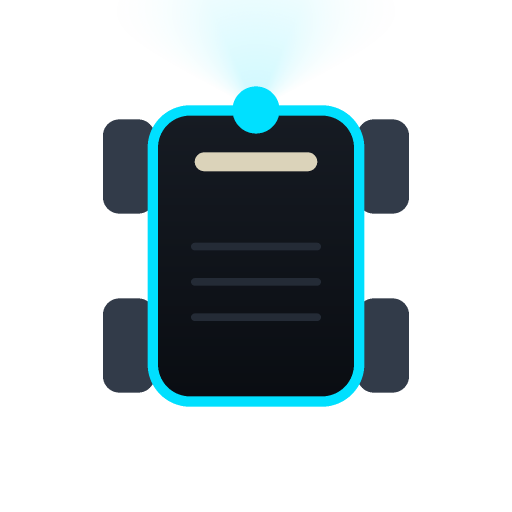
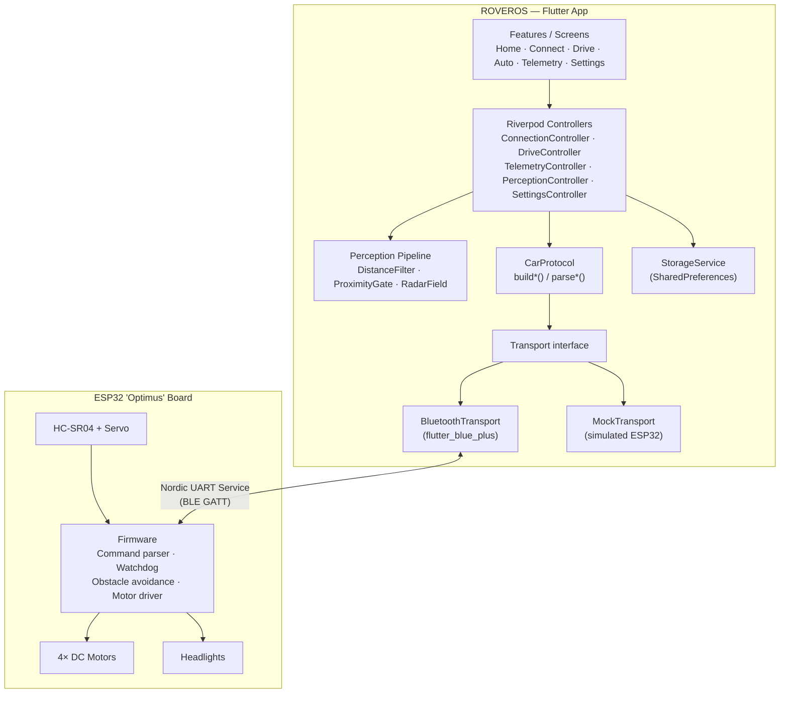
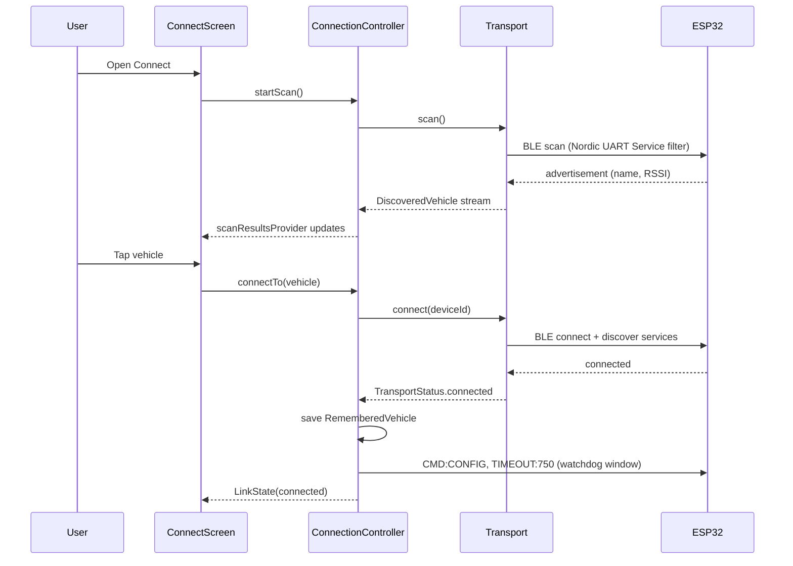
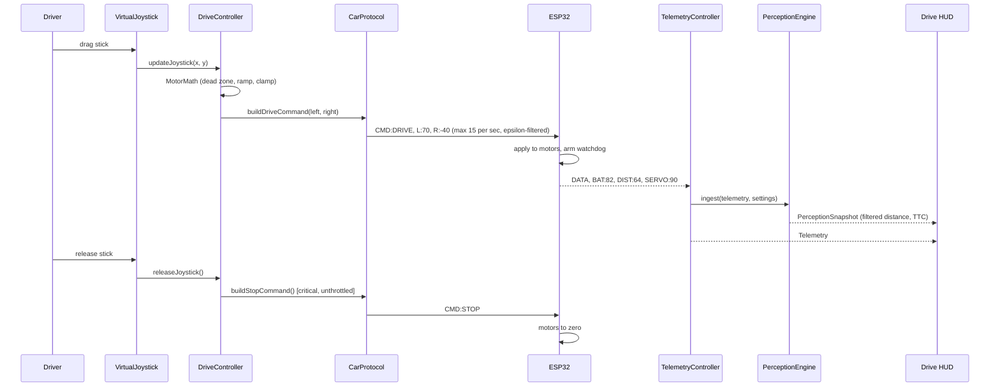
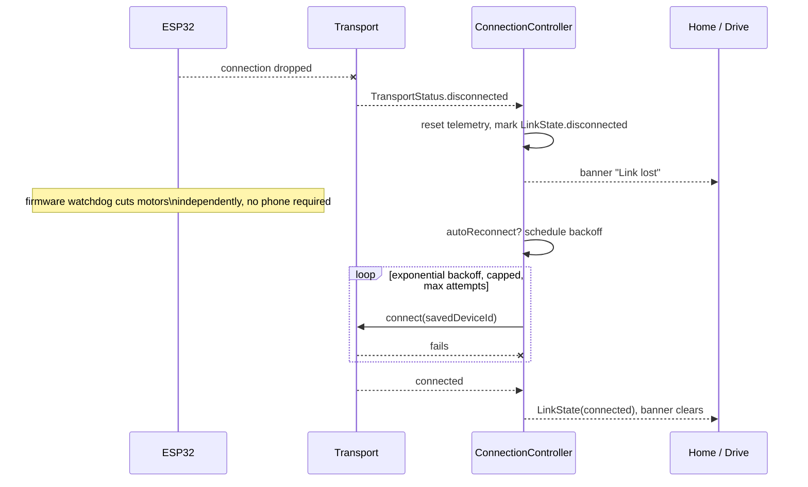

<div align="center">
  

  # ROVEROS

  **A premium, dashboard-style control console for a DIY ESP32 4WD smart robot car.**

  Built to feel like an EV instrument cluster and an RC transmitter — not a bare-bones Arduino remote.

  <p>
    
    
    
    
    
  </p>
</div>

---

> **⚠ Proprietary — Closed Source.** This repository and everything in it is
> confidential and proprietary. No licence is granted to use, copy, modify,
> merge, publish, distribute, sublicense, or sell copies of this software.
> See [License](#license).

## Table of contents

- [What this is](#what-this-is)
- [Tech stack](#tech-stack)
- [Hardware target](#hardware-target)
- [Screens](#screens)
- [Architecture](#architecture)
- [Data flow](#data-flow)
- [Sequence diagrams](#sequence-diagrams)
- [Safety model](#safety-model)
- [How it works, step by step](#how-it-works-step-by-step)
- [Getting started](#getting-started)
- [Testing](#testing)
- [Known limitations](#known-limitations)
- [License](#license)

## What this is

ROVEROS pairs with an ESP32 rover over BLE, drives it with an analog virtual
joystick, and surfaces live telemetry (battery, distance, servo angle, motor
output) on a dark, high-contrast dashboard. A phone-side perception layer
turns the raw HC-SR04 ultrasonic sensor into a filtered, confidence-scored
estimate — closing speed, time-to-contact, gap-finding — without the vehicle
ever ceding a single safety decision to the app. It also runs a fully
autonomous **mock rover** with no hardware attached, so the whole app —
including its safety behaviour — can be built, demoed, and tested without a
soldering iron.

## Tech stack

| Layer | Technology | Purpose |
|---|---|---|
| Language | [Dart 3.12+](https://dart.dev) | Sound null safety, pattern matching, sealed classes for the frame/error models |
| Framework | [Flutter 3.44](https://flutter.dev) | Single codebase, Android + iOS |
| State management | [flutter_riverpod](https://riverpod.dev) `^3.4.2` | `Notifier`s per concern (connection, drive, telemetry, settings, perception) |
| Routing | [go_router](https://pub.dev/packages/go_router) `^17.4.0` | Declarative routes, `StatefulShellRoute` for the bottom-tab shell |
| Transport | [flutter_blue_plus](https://pub.dev/packages/flutter_blue_plus) `^2.3.11` | BLE central role — scan, connect, notify/write against Nordic UART Service |
| Permissions | [permission_handler](https://pub.dev/packages/permission_handler) `^13.0.0` | Runtime Bluetooth/location permission flow |
| Persistence | [shared_preferences](https://pub.dev/packages/shared_preferences) `^2.5.5` | Settings, remembered vehicle, activity log |
| Sharing | [share_plus](https://pub.dev/packages/share_plus) `^12.0.1` | Session-log export from the Telemetry screen |
| Firmware target | ESP32 ("Optimus" board) | BLE peripheral, motor driver, sensor I/O, the only thing that decides to stop |
| Testing | `flutter_test` | 100 tests — protocol, motor math, perception filters, layout metrics, a11y |

## Hardware target

| Component | Role |
|---|---|
| ESP32 "Optimus" controller board | Central MCU, BLE peripheral |
| 4× TT geared DC motor + driver | Differential drive |
| 2× 18650 Li-ion | Power |
| HC-SR04 | Front obstacle distance |
| SG90 9g servo | Sweeps the HC-SR04 for the radar view |
| White LED headlights | Solid / flash / hazard, ESP32-timed |

**The phone never makes a safety decision.** Motor stop logic, the
communication watchdog, and autonomous obstacle-avoidance decisions all live
on the ESP32. The app only sends high-level commands and displays what the
vehicle reports back — see [Safety model](#safety-model) below.

## Screens

| Screen | Orientation | Purpose |
|---|---|---|
| Splash | Portrait | Boot sequence: load settings, check saved vehicle, animate in |
| Home | Portrait | Vehicle status, battery, readiness, recent activity, START DRIVING |
| Connect | Portrait | BLE scan/connect/reconnect, connection-quality detail |
| **Drive** | **Landscape** | Joystick, speed, emergency stop, lights, distance, servo/radar preview |
| Auto | Portrait | MANUAL / OBSTACLE AVOIDANCE / AUTO SCAN, live radar, vehicle decisions |
| Telemetry | Portrait | Full dashboard: every reported value, link health, trend sparklines, last ACK, errors |
| Settings | Portrait | Vehicle, controls, motors, sensors, lights, connection, app preferences |

## Architecture

```
lib/
  core/          theme, constants, router, pure utils (motor math, throttle,
                 clamp, validation), perception pipeline, Riverpod bootstrap
  models/        strongly-typed domain types (Telemetry, Settings, Commands,
                 ConnectionState, Vehicle) — no protocol strings, no widgets
  services/      car_protocol.dart (the ONLY place that builds/parses wire
                 frames), storage_service.dart, transport/ (the abstraction)
  features/      one folder per screen: screen + controller (Riverpod
                 Notifier) + local widgets/
  widgets/       the shared UI kit (AppButton, AppCard, TelemetryCard, …)
```

**Transport abstraction.** `Transport` is a single interface
(`connect/disconnect/send/subscribe/scan`) implemented by both
`BluetoothTransport` (flutter_blue_plus) and `MockTransport` (a simulated
ESP32 with its own watchdog, telemetry stream, and injectable faults). The UI
and `DriveController` depend only on this interface, so mock and real
hardware are interchangeable behind one `transportProvider`.

**Protocol.** Every wire token lives in
[`command_constants.dart`](lib/core/constants/command_constants.dart); every
frame is built or parsed exclusively by
[`car_protocol.dart`](lib/services/car_protocol.dart)
(`buildDriveCommand`, `buildStopCommand`, `parseTelemetry`, `parseAck`,
`parseError`, `validateCommand`, …). No widget ever touches a raw command
string.

**State.** Riverpod `Notifier`s split communication state
(`ConnectionController`, holding the `LinkState`) from commanded/UI state
(`DriveController`, holding the `DriveState`) from vehicle-reported truth
(`TelemetryController`) from phone-side inference (`PerceptionController`,
holding a `PerceptionSnapshot`). Settings persist through `StorageService`
(SharedPreferences) and are re-validated on every load.

**Perception.** `core/perception/` is an ordinary Dart pipeline (no Flutter,
no Riverpod) that turns one HC-SR04 reading per servo bearing into a filtered
estimate: a Kalman-style `DistanceFilter` per bucketed angle, a `ProximityGate`
that adds hysteresis so a boundary reading can't strobe the UI between
states, and a `RadarField` that segments the swept readings into surfaces and
gaps. It is advisory end to end — nothing downstream may build a command from
it, and the ESP32 never sees its output.

### Component diagram



## Data flow

Two independent loops run at all times once connected — an outbound command
loop and an inbound telemetry loop — plus a phone-side inference stage that
sits only on the inbound side.



```mermaid
flowchart LR
    Stick["Virtual Joystick"] -->|"x, y"| DriveCtrl["DriveController"]
    Speed["Speed / Lights / Servo controls"] --> DriveCtrl
    DriveCtrl -->|"throttled max 15 per sec\nepsilon-filtered"| Protocol1["CarProtocol.build*()"]
    Protocol1 -->|"CMD:DRIVE, L:70, R:-40"| Transport1["Transport.send()"]
    Transport1 -->|"BLE write"| ESP32["ESP32 firmware"]

    ESP32 -->|"BLE notify"| Transport2["Transport.subscribe()"]
    Transport2 -->|"DATA, BAT:82, DIST:64, ..."| Protocol2["CarProtocol.parseFrame()"]
    Protocol2 -->|"TelemetryFrame"| TelemetryCtrl["TelemetryController"]
    Protocol2 -->|"AckFrame"| AckState["lastAckProvider"]
    Protocol2 -->|"ErrorFrame"| ErrorState["vehicleErrorProvider"]

    TelemetryCtrl --> PerceptionEngine["PerceptionEngine\n(DistanceFilter → ProximityGate → RadarField)"]
    PerceptionEngine --> PerceptionSnapshot["PerceptionSnapshot\nfiltered distance · confidence\nclosing speed · time-to-contact · gaps"]

    TelemetryCtrl --> DashboardUI["Home / Telemetry / Drive HUD"]
    PerceptionSnapshot --> DashboardUI
    AckState --> DashboardUI
    ErrorState --> DashboardUI
    ErrorState -->|"fail-safe error"| AutoCtrl["AutoScreen listener\nforces DriveMode.manual"]
```

## Sequence diagrams

### Pairing and connecting



### Driving loop (joystick → command → telemetry)



### Link loss and recovery



## Safety model

1. **The ESP32 owns the stop.** It runs its own communication watchdog — if
   no valid drive command arrives within a configurable window (sent via
   `CMD:CONFIG;TIMEOUT:ms`, default 750ms), it cuts the motors itself. The app
   never has to succeed at sending a message for the vehicle to stop safely.
2. **Release-to-stop bypasses everything.** Letting go of the joystick sends
   `CMD:STOP` immediately, ungated by throttling or acceleration ramping.
3. **Leaving Drive, backgrounding the app, or losing the link** all trigger an
   immediate stop attempt and clear the commanded output client-side.
4. **Emergency stop latches.** It requires a deliberate second tap to release
   — a twitching thumb can't immediately re-arm the motors.
5. **Autonomous decisions happen on the vehicle.** The phone only sends
   `CMD:MODE`/`CMD:SCAN` and displays `telemetry.decision`; a reported sensor
   or motor fault automatically drops the app out of autonomous mode.
6. **Drive commands are throttled and epsilon-filtered** (≤15/s, changes below
   a small threshold are skipped) so the radio is never flooded — but a
   transition to or from a full stop is never suppressed.
7. **Perception is advisory only.** The phone-side filter can flag an obstacle
   as unreliable or estimate time-to-contact, but it never builds a command —
   it only tells the driver what it believes, and says plainly when it
   doesn't believe itself.

## How it works, step by step

1. **Boot.** `SplashScreen` loads persisted settings, checks for a remembered
   vehicle, and routes to onboarding (first run) or the shell (returning
   user).
2. **Pair.** `Connect` scans for BLE devices advertising the Nordic UART
   Service, surfaces the saved vehicle first, and connects on tap. On
   success, the watchdog timeout is pushed to the ESP32 and the vehicle is
   remembered for next time.
3. **Drive.** Opening Drive forces landscape, arms the HUD, and starts
   streaming joystick input as throttled `CMD:DRIVE` frames. Releasing the
   stick, leaving the screen, or backgrounding the app all force `CMD:STOP`.
4. **Watch.** Every inbound `DATA` frame updates `TelemetryController`, feeds
   the perception pipeline for a filtered distance/confidence/closing-speed
   read, and republishes through Home, Drive and the Telemetry dashboard —
   all from the same single source of truth.
5. **Go autonomous.** Selecting an `AutoBehaviour` sends `CMD:MODE`/`CMD:SCAN`
   and nothing else; the ESP32 makes every avoidance decision and reports it
   back via `telemetry.decision`. A fail-safe error drops the app back to
   manual automatically.
6. **Recover.** A dropped link is detected from the transport's own status
   stream, triggers an immediate UI banner, and — if enabled — an exponential
   backoff reconnect using the last remembered device, all while the ESP32's
   own watchdog has already stopped the motors independently.
7. **Configure.** Settings changes (speed cap, dead zone, obstacle
   thresholds, motor trim) persist immediately via `StorageService` and are
   re-validated on every load so a corrupted or out-of-range stored value can
   never reach the vehicle.

## Getting started

```bash
flutter pub get
flutter run                # Mock mode is on by default — no hardware needed
```

Mock mode is enabled out of the box (Settings → App → **Mock car mode**), so
`flutter run` gets you a fully interactive simulated rover immediately:
connect, drive, watch the battery drain under load, trigger obstacle
avoidance, and inject faults, all without an ESP32 in the room.

To drive real hardware, turn **Mock car mode** off in Settings. The app then
scans for BLE devices exposing the Nordic UART Service (the de-facto BLE
serial profile most ESP32 Arduino sketches use) — see
[`lib/core/constants/app_config.dart`](lib/core/constants/app_config.dart) for
the service/characteristic UUIDs your firmware needs to expose.

### Requirements

- Flutter 3.44+ / Dart 3.12+ (`environment: sdk: ^3.12.2` in `pubspec.yaml`)
- Android: minSdk 24, targetSdk 36 (BLE central role needs API 23+)
- iOS: Bluetooth usage descriptions are already set in `Info.plist`

### Building

```bash
flutter build apk --debug     # or --release with your own signing config
flutter build ios             # requires Xcode + a valid provisioning profile
```

The debug Android build uses debug signing so `flutter run --release` works
out of the box; wire up real release signing in `android/app/build.gradle.kts`
before shipping to a store.

## Testing

```bash
flutter test        # 100 tests: protocol, motor math, safety, layout metrics
flutter analyze      # zero warnings
```

Coverage focuses on what actually breaks a robot: differential-drive math,
dead-zone and speed-limit clamping, accel/decel ramping, command
serialisation/validation, telemetry parsing (including malformed and
out-of-range frames), emergency stop, disconnect handling, and the firmware
watchdog — exercised end-to-end against `MockTransport`, not just asserted in
isolation.

## Known limitations

- Bluetooth has only been exercised against `MockTransport` in this
  environment; `BluetoothTransport` compiles and follows the Nordic UART
  Service convention, but pairing with real ESP32 firmware has not been
  hardware-verified here.
- No CI pipeline is configured — `flutter analyze` / `flutter test` /
  `flutter build apk` are run manually (see [Testing](#testing)).
- Release signing for Android/iOS is left to the maintainer.

## License

**Proprietary — All Rights Reserved.**

Copyright © 2026. This repository, including its source code, assets, and
documentation, is confidential and proprietary. It is **not** open source.

No part of this project may be copied, modified, merged, published,
distributed, sublicensed, or sold without the prior written permission of
the copyright holder. Access to this repository does not grant any licence,
implied or otherwise, to use it outside the scope explicitly agreed with the
owner.

